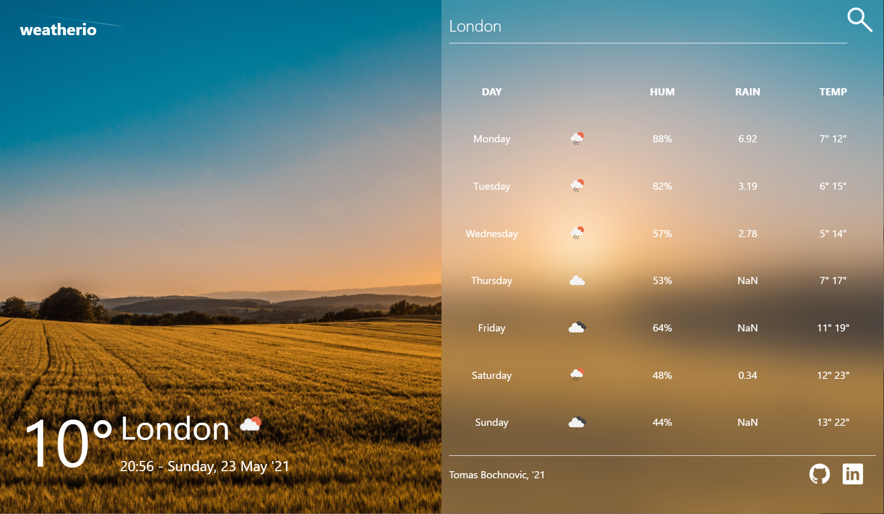
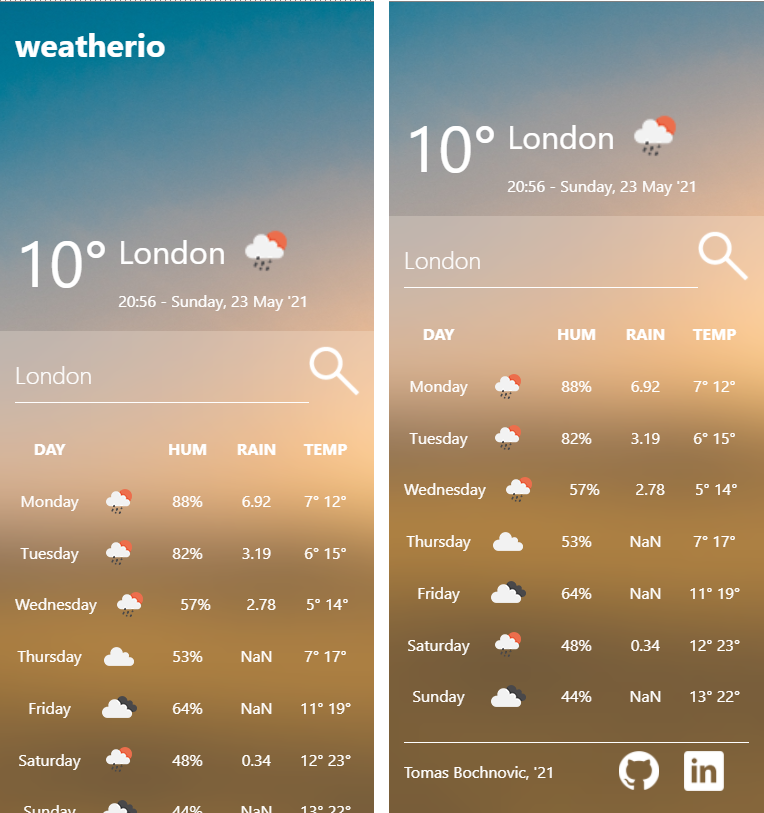

# Weather dashboard weatherio

Dashboard made in asynchronous vanilla javascript and webpack.

## Desktop view

## Phone view

# How to run

1. Clone/download repository
2. Replace the YOUR_API_KEY with your api key from OpenWeather
3. Open the index.html in your browser
